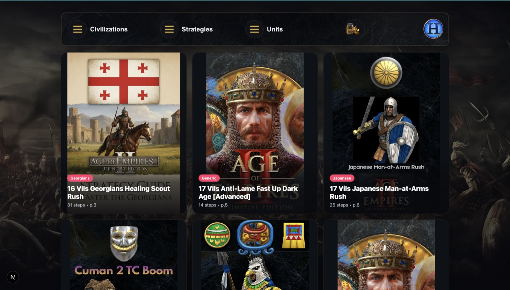

# AoE2 Strategy Companion

A clean, fast browser for Age of Empires II build orders. Pick a
civilization, filter by strategy type or unit, and open any build to see
its step-by-step order with running resource/population totals.

Built with Next.js (App Router) + React. All data is local — no backend,
no external services.



## Getting Started

```bash
npm install
npm run dev
```

Open [http://localhost:3000](http://localhost:3000).

## Project structure

- `src/app/page.tsx` — home: HUD menus (Civilizations / Strategies / Units) + search + card grid
- `src/app/components/StrategyCard.tsx` — the hover card (banner, civ pills, "View Strategy")
- `src/app/strategy/[id]/page.tsx` — build detail: steps with food/wood/gold/stone/pop totals and age icons
- `src/lib/civs.ts` — civ name → id lookup
- `src/types/strategy.ts` — data types
- `data/strategy.json` — the build-order dataset (28 builds, 33 civs)
- `public/` — civ icons, build/civ banners, age & resource icons

## Data

`data/strategy.json` is the single source of truth and is imported
directly (statically bundled). Build steps may carry inline annotations
(`@@set:` / `@@add:` / `@@move:`) that the detail page parses into the
resource totals shown on the right.

## Scripts

- `npm run dev` — start the dev server
- `npm run build` — production build
- `npm run start` — serve the production build
- `npm run lint` — run ESLint
